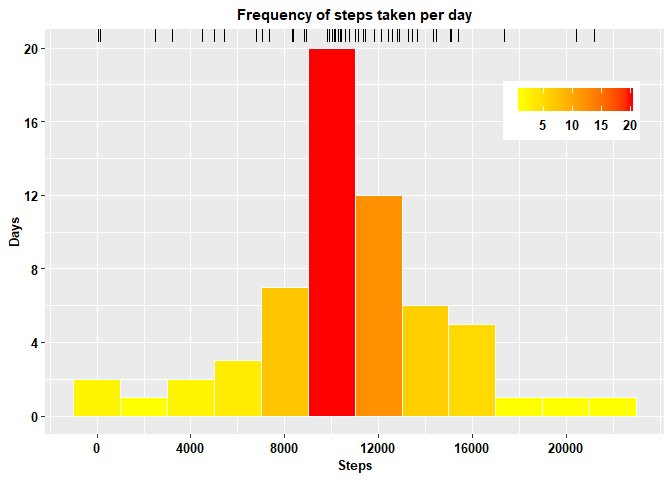

&nbsp;

## Main Tasks
1. Loading and preprocessing the data
    + Load the data
    + Process/transform the data (if necessary)
2. Calculating mean total number of steps taken per day
    + Total number of steps taken per day
    + Make a histogram of the total number of steps taken each day
    + Report the mean and median of the total number of steps taken per day
3. Average daily activity pattern
    + Make a time series plot of the 5-minute interval and the average number of steps taken, averaged across all days
    + Determine 5-minutes interval containing the maximum number of steps
4. Imputing missing values
    + Report the total number of missing values in the dataset
    + Fill in all of the missing values
    + Create a new dataset that is equal to the original dataset but with the missing data filled in
    + Make a histogram of the total number of steps taken each day
    + Report the mean and median of the total number of steps taken per day
    + Report the difference in mean, median and total number of steps in new and old datasets
5. Differences in activity patterns between weekdays and weekends
    + Create a new factor variable in the dataset with two levels – “weekday” and “weekend”
    + Make a panel plot containing a time series plot of the 5-minute interval and the average number of steps taken, averaged across all weekday days or weekend days

&nbsp;

## 1. Loading and preprocessing the data
### 1.1 Data loading

```r
library(knitr, warn.conflicts = FALSE)
library(dplyr, warn.conflicts = FALSE)
library(ggplot2, warn.conflicts = FALSE)
library(kableExtra, warn.conflicts = FALSE)

setwd("C:/Users/junai/Desktop")
activity <- read.csv("activity.csv")
```

### 1.2 Data preprocessing/transforming
Not required!

&nbsp;

## 2. Calculating mean total number of steps taken per day
### 2.1 Total number of steps

```r
total_steps <- sum(activity$steps, na.rm = TRUE)
cat("Total number of steps: ", total_steps)
```

```
## Total number of steps:  570608
```

### Reporting the total, mean and median for steps taken per day

```r
# calculate steps total, mean, median and number of NAs for each day
date_stats <- activity %>%
              group_by(date) %>%
              summarise(Total = sum(steps, na.rm=TRUE),
                        Mean = mean(steps, na.rm=TRUE),
                        Median = median(steps, na.rm=TRUE),
                        NAs = sum(is.na(steps)))

date_stats %>%
  knitr::kable(format="html", digits=0) %>%
  kable_styling(bootstrap_options = "striped",
              full_width = F,
              position = "center")
```

<table class="table table-striped" style="width: auto !important; margin-left: auto; margin-right: auto;">
 <thead>
  <tr>
   <th style="text-align:left;"> date </th>
   <th style="text-align:right;"> Total </th>
   <th style="text-align:right;"> Mean </th>
   <th style="text-align:right;"> Median </th>
   <th style="text-align:right;"> NAs </th>
  </tr>
 </thead>
<tbody>
  <tr>
   <td style="text-align:left;"> 2012-10-01 </td>
   <td style="text-align:right;"> 0 </td>
   <td style="text-align:right;"> NaN </td>
   <td style="text-align:right;"> NA </td>
   <td style="text-align:right;"> 288 </td>
  </tr>
  <tr>
   <td style="text-align:left;"> 2012-10-02 </td>
   <td style="text-align:right;"> 126 </td>
   <td style="text-align:right;"> 0 </td>
   <td style="text-align:right;"> 0 </td>
   <td style="text-align:right;"> 0 </td>
  </tr>
  <tr>
   <td style="text-align:left;"> 2012-10-03 </td>
   <td style="text-align:right;"> 11352 </td>
   <td style="text-align:right;"> 39 </td>
   <td style="text-align:right;"> 0 </td>
   <td style="text-align:right;"> 0 </td>
  </tr>
  <tr>
   <td style="text-align:left;"> 2012-10-04 </td>
   <td style="text-align:right;"> 12116 </td>
   <td style="text-align:right;"> 42 </td>
   <td style="text-align:right;"> 0 </td>
   <td style="text-align:right;"> 0 </td>
  </tr>
  <tr>
   <td style="text-align:left;"> 2012-10-05 </td>
   <td style="text-align:right;"> 13294 </td>
   <td style="text-align:right;"> 46 </td>
   <td style="text-align:right;"> 0 </td>
   <td style="text-align:right;"> 0 </td>
  </tr>
  <tr>
   <td style="text-align:left;"> 2012-10-06 </td>
   <td style="text-align:right;"> 15420 </td>
   <td style="text-align:right;"> 54 </td>
   <td style="text-align:right;"> 0 </td>
   <td style="text-align:right;"> 0 </td>
  </tr>
  <tr>
   <td style="text-align:left;"> 2012-10-07 </td>
   <td style="text-align:right;"> 11015 </td>
   <td style="text-align:right;"> 38 </td>
   <td style="text-align:right;"> 0 </td>
   <td style="text-align:right;"> 0 </td>
  </tr>
  <tr>
   <td style="text-align:left;"> 2012-10-08 </td>
   <td style="text-align:right;"> 0 </td>
   <td style="text-align:right;"> NaN </td>
   <td style="text-align:right;"> NA </td>
   <td style="text-align:right;"> 288 </td>
  </tr>
  <tr>
   <td style="text-align:left;"> 2012-10-09 </td>
   <td style="text-align:right;"> 12811 </td>
   <td style="text-align:right;"> 44 </td>
   <td style="text-align:right;"> 0 </td>
   <td style="text-align:right;"> 0 </td>
  </tr>
  <tr>
   <td style="text-align:left;"> 2012-10-10 </td>
   <td style="text-align:right;"> 9900 </td>
   <td style="text-align:right;"> 34 </td>
   <td style="text-align:right;"> 0 </td>
   <td style="text-align:right;"> 0 </td>
  </tr>
  <tr>
   <td style="text-align:left;"> 2012-10-11 </td>
   <td style="text-align:right;"> 10304 </td>
   <td style="text-align:right;"> 36 </td>
   <td style="text-align:right;"> 0 </td>
   <td style="text-align:right;"> 0 </td>
  </tr>
  <tr>
   <td style="text-align:left;"> 2012-10-12 </td>
   <td style="text-align:right;"> 17382 </td>
   <td style="text-align:right;"> 60 </td>
   <td style="text-align:right;"> 0 </td>
   <td style="text-align:right;"> 0 </td>
  </tr>
  <tr>
   <td style="text-align:left;"> 2012-10-13 </td>
   <td style="text-align:right;"> 12426 </td>
   <td style="text-align:right;"> 43 </td>
   <td style="text-align:right;"> 0 </td>
   <td style="text-align:right;"> 0 </td>
  </tr>
  <tr>
   <td style="text-align:left;"> 2012-10-14 </td>
   <td style="text-align:right;"> 15098 </td>
   <td style="text-align:right;"> 52 </td>
   <td style="text-align:right;"> 0 </td>
   <td style="text-align:right;"> 0 </td>
  </tr>
  <tr>
   <td style="text-align:left;"> 2012-10-15 </td>
   <td style="text-align:right;"> 10139 </td>
   <td style="text-align:right;"> 35 </td>
   <td style="text-align:right;"> 0 </td>
   <td style="text-align:right;"> 0 </td>
  </tr>
  <tr>
   <td style="text-align:left;"> 2012-10-16 </td>
   <td style="text-align:right;"> 15084 </td>
   <td style="text-align:right;"> 52 </td>
   <td style="text-align:right;"> 0 </td>
   <td style="text-align:right;"> 0 </td>
  </tr>
  <tr>
   <td style="text-align:left;"> 2012-10-17 </td>
   <td style="text-align:right;"> 13452 </td>
   <td style="text-align:right;"> 47 </td>
   <td style="text-align:right;"> 0 </td>
   <td style="text-align:right;"> 0 </td>
  </tr>
  <tr>
   <td style="text-align:left;"> 2012-10-18 </td>
   <td style="text-align:right;"> 10056 </td>
   <td style="text-align:right;"> 35 </td>
   <td style="text-align:right;"> 0 </td>
   <td style="text-align:right;"> 0 </td>
  </tr>
  <tr>
   <td style="text-align:left;"> 2012-10-19 </td>
   <td style="text-align:right;"> 11829 </td>
   <td style="text-align:right;"> 41 </td>
   <td style="text-align:right;"> 0 </td>
   <td style="text-align:right;"> 0 </td>
  </tr>
  <tr>
   <td style="text-align:left;"> 2012-10-20 </td>
   <td style="text-align:right;"> 10395 </td>
   <td style="text-align:right;"> 36 </td>
   <td style="text-align:right;"> 0 </td>
   <td style="text-align:right;"> 0 </td>
  </tr>
  <tr>
   <td style="text-align:left;"> 2012-10-21 </td>
   <td style="text-align:right;"> 8821 </td>
   <td style="text-align:right;"> 31 </td>
   <td style="text-align:right;"> 0 </td>
   <td style="text-align:right;"> 0 </td>
  </tr>
  <tr>
   <td style="text-align:left;"> 2012-10-22 </td>
   <td style="text-align:right;"> 13460 </td>
   <td style="text-align:right;"> 47 </td>
   <td style="text-align:right;"> 0 </td>
   <td style="text-align:right;"> 0 </td>
  </tr>
  <tr>
   <td style="text-align:left;"> 2012-10-23 </td>
   <td style="text-align:right;"> 8918 </td>
   <td style="text-align:right;"> 31 </td>
   <td style="text-align:right;"> 0 </td>
   <td style="text-align:right;"> 0 </td>
  </tr>
  <tr>
   <td style="text-align:left;"> 2012-10-24 </td>
   <td style="text-align:right;"> 8355 </td>
   <td style="text-align:right;"> 29 </td>
   <td style="text-align:right;"> 0 </td>
   <td style="text-align:right;"> 0 </td>
  </tr>
  <tr>
   <td style="text-align:left;"> 2012-10-25 </td>
   <td style="text-align:right;"> 2492 </td>
   <td style="text-align:right;"> 9 </td>
   <td style="text-align:right;"> 0 </td>
   <td style="text-align:right;"> 0 </td>
  </tr>
  <tr>
   <td style="text-align:left;"> 2012-10-26 </td>
   <td style="text-align:right;"> 6778 </td>
   <td style="text-align:right;"> 24 </td>
   <td style="text-align:right;"> 0 </td>
   <td style="text-align:right;"> 0 </td>
  </tr>
  <tr>
   <td style="text-align:left;"> 2012-10-27 </td>
   <td style="text-align:right;"> 10119 </td>
   <td style="text-align:right;"> 35 </td>
   <td style="text-align:right;"> 0 </td>
   <td style="text-align:right;"> 0 </td>
  </tr>
  <tr>
   <td style="text-align:left;"> 2012-10-28 </td>
   <td style="text-align:right;"> 11458 </td>
   <td style="text-align:right;"> 40 </td>
   <td style="text-align:right;"> 0 </td>
   <td style="text-align:right;"> 0 </td>
  </tr>
  <tr>
   <td style="text-align:left;"> 2012-10-29 </td>
   <td style="text-align:right;"> 5018 </td>
   <td style="text-align:right;"> 17 </td>
   <td style="text-align:right;"> 0 </td>
   <td style="text-align:right;"> 0 </td>
  </tr>
  <tr>
   <td style="text-align:left;"> 2012-10-30 </td>
   <td style="text-align:right;"> 9819 </td>
   <td style="text-align:right;"> 34 </td>
   <td style="text-align:right;"> 0 </td>
   <td style="text-align:right;"> 0 </td>
  </tr>
  <tr>
   <td style="text-align:left;"> 2012-10-31 </td>
   <td style="text-align:right;"> 15414 </td>
   <td style="text-align:right;"> 54 </td>
   <td style="text-align:right;"> 0 </td>
   <td style="text-align:right;"> 0 </td>
  </tr>
  <tr>
   <td style="text-align:left;"> 2012-11-01 </td>
   <td style="text-align:right;"> 0 </td>
   <td style="text-align:right;"> NaN </td>
   <td style="text-align:right;"> NA </td>
   <td style="text-align:right;"> 288 </td>
  </tr>
  <tr>
   <td style="text-align:left;"> 2012-11-02 </td>
   <td style="text-align:right;"> 10600 </td>
   <td style="text-align:right;"> 37 </td>
   <td style="text-align:right;"> 0 </td>
   <td style="text-align:right;"> 0 </td>
  </tr>
  <tr>
   <td style="text-align:left;"> 2012-11-03 </td>
   <td style="text-align:right;"> 10571 </td>
   <td style="text-align:right;"> 37 </td>
   <td style="text-align:right;"> 0 </td>
   <td style="text-align:right;"> 0 </td>
  </tr>
  <tr>
   <td style="text-align:left;"> 2012-11-04 </td>
   <td style="text-align:right;"> 0 </td>
   <td style="text-align:right;"> NaN </td>
   <td style="text-align:right;"> NA </td>
   <td style="text-align:right;"> 288 </td>
  </tr>
  <tr>
   <td style="text-align:left;"> 2012-11-05 </td>
   <td style="text-align:right;"> 10439 </td>
   <td style="text-align:right;"> 36 </td>
   <td style="text-align:right;"> 0 </td>
   <td style="text-align:right;"> 0 </td>
  </tr>
  <tr>
   <td style="text-align:left;"> 2012-11-06 </td>
   <td style="text-align:right;"> 8334 </td>
   <td style="text-align:right;"> 29 </td>
   <td style="text-align:right;"> 0 </td>
   <td style="text-align:right;"> 0 </td>
  </tr>
  <tr>
   <td style="text-align:left;"> 2012-11-07 </td>
   <td style="text-align:right;"> 12883 </td>
   <td style="text-align:right;"> 45 </td>
   <td style="text-align:right;"> 0 </td>
   <td style="text-align:right;"> 0 </td>
  </tr>
  <tr>
   <td style="text-align:left;"> 2012-11-08 </td>
   <td style="text-align:right;"> 3219 </td>
   <td style="text-align:right;"> 11 </td>
   <td style="text-align:right;"> 0 </td>
   <td style="text-align:right;"> 0 </td>
  </tr>
  <tr>
   <td style="text-align:left;"> 2012-11-09 </td>
   <td style="text-align:right;"> 0 </td>
   <td style="text-align:right;"> NaN </td>
   <td style="text-align:right;"> NA </td>
   <td style="text-align:right;"> 288 </td>
  </tr>
  <tr>
   <td style="text-align:left;"> 2012-11-10 </td>
   <td style="text-align:right;"> 0 </td>
   <td style="text-align:right;"> NaN </td>
   <td style="text-align:right;"> NA </td>
   <td style="text-align:right;"> 288 </td>
  </tr>
  <tr>
   <td style="text-align:left;"> 2012-11-11 </td>
   <td style="text-align:right;"> 12608 </td>
   <td style="text-align:right;"> 44 </td>
   <td style="text-align:right;"> 0 </td>
   <td style="text-align:right;"> 0 </td>
  </tr>
  <tr>
   <td style="text-align:left;"> 2012-11-12 </td>
   <td style="text-align:right;"> 10765 </td>
   <td style="text-align:right;"> 37 </td>
   <td style="text-align:right;"> 0 </td>
   <td style="text-align:right;"> 0 </td>
  </tr>
  <tr>
   <td style="text-align:left;"> 2012-11-13 </td>
   <td style="text-align:right;"> 7336 </td>
   <td style="text-align:right;"> 25 </td>
   <td style="text-align:right;"> 0 </td>
   <td style="text-align:right;"> 0 </td>
  </tr>
  <tr>
   <td style="text-align:left;"> 2012-11-14 </td>
   <td style="text-align:right;"> 0 </td>
   <td style="text-align:right;"> NaN </td>
   <td style="text-align:right;"> NA </td>
   <td style="text-align:right;"> 288 </td>
  </tr>
  <tr>
   <td style="text-align:left;"> 2012-11-15 </td>
   <td style="text-align:right;"> 41 </td>
   <td style="text-align:right;"> 0 </td>
   <td style="text-align:right;"> 0 </td>
   <td style="text-align:right;"> 0 </td>
  </tr>
  <tr>
   <td style="text-align:left;"> 2012-11-16 </td>
   <td style="text-align:right;"> 5441 </td>
   <td style="text-align:right;"> 19 </td>
   <td style="text-align:right;"> 0 </td>
   <td style="text-align:right;"> 0 </td>
  </tr>
  <tr>
   <td style="text-align:left;"> 2012-11-17 </td>
   <td style="text-align:right;"> 14339 </td>
   <td style="text-align:right;"> 50 </td>
   <td style="text-align:right;"> 0 </td>
   <td style="text-align:right;"> 0 </td>
  </tr>
  <tr>
   <td style="text-align:left;"> 2012-11-18 </td>
   <td style="text-align:right;"> 15110 </td>
   <td style="text-align:right;"> 52 </td>
   <td style="text-align:right;"> 0 </td>
   <td style="text-align:right;"> 0 </td>
  </tr>
  <tr>
   <td style="text-align:left;"> 2012-11-19 </td>
   <td style="text-align:right;"> 8841 </td>
   <td style="text-align:right;"> 31 </td>
   <td style="text-align:right;"> 0 </td>
   <td style="text-align:right;"> 0 </td>
  </tr>
  <tr>
   <td style="text-align:left;"> 2012-11-20 </td>
   <td style="text-align:right;"> 4472 </td>
   <td style="text-align:right;"> 16 </td>
   <td style="text-align:right;"> 0 </td>
   <td style="text-align:right;"> 0 </td>
  </tr>
  <tr>
   <td style="text-align:left;"> 2012-11-21 </td>
   <td style="text-align:right;"> 12787 </td>
   <td style="text-align:right;"> 44 </td>
   <td style="text-align:right;"> 0 </td>
   <td style="text-align:right;"> 0 </td>
  </tr>
  <tr>
   <td style="text-align:left;"> 2012-11-22 </td>
   <td style="text-align:right;"> 20427 </td>
   <td style="text-align:right;"> 71 </td>
   <td style="text-align:right;"> 0 </td>
   <td style="text-align:right;"> 0 </td>
  </tr>
  <tr>
   <td style="text-align:left;"> 2012-11-23 </td>
   <td style="text-align:right;"> 21194 </td>
   <td style="text-align:right;"> 74 </td>
   <td style="text-align:right;"> 0 </td>
   <td style="text-align:right;"> 0 </td>
  </tr>
  <tr>
   <td style="text-align:left;"> 2012-11-24 </td>
   <td style="text-align:right;"> 14478 </td>
   <td style="text-align:right;"> 50 </td>
   <td style="text-align:right;"> 0 </td>
   <td style="text-align:right;"> 0 </td>
  </tr>
  <tr>
   <td style="text-align:left;"> 2012-11-25 </td>
   <td style="text-align:right;"> 11834 </td>
   <td style="text-align:right;"> 41 </td>
   <td style="text-align:right;"> 0 </td>
   <td style="text-align:right;"> 0 </td>
  </tr>
  <tr>
   <td style="text-align:left;"> 2012-11-26 </td>
   <td style="text-align:right;"> 11162 </td>
   <td style="text-align:right;"> 39 </td>
   <td style="text-align:right;"> 0 </td>
   <td style="text-align:right;"> 0 </td>
  </tr>
  <tr>
   <td style="text-align:left;"> 2012-11-27 </td>
   <td style="text-align:right;"> 13646 </td>
   <td style="text-align:right;"> 47 </td>
   <td style="text-align:right;"> 0 </td>
   <td style="text-align:right;"> 0 </td>
  </tr>
  <tr>
   <td style="text-align:left;"> 2012-11-28 </td>
   <td style="text-align:right;"> 10183 </td>
   <td style="text-align:right;"> 35 </td>
   <td style="text-align:right;"> 0 </td>
   <td style="text-align:right;"> 0 </td>
  </tr>
  <tr>
   <td style="text-align:left;"> 2012-11-29 </td>
   <td style="text-align:right;"> 7047 </td>
   <td style="text-align:right;"> 24 </td>
   <td style="text-align:right;"> 0 </td>
   <td style="text-align:right;"> 0 </td>
  </tr>
  <tr>
   <td style="text-align:left;"> 2012-11-30 </td>
   <td style="text-align:right;"> 0 </td>
   <td style="text-align:right;"> NaN </td>
   <td style="text-align:right;"> NA </td>
   <td style="text-align:right;"> 288 </td>
  </tr>
</tbody>
</table>

&nbsp;

### 2.2 Histogram of total number of steps

```r
g <-ggplot(date_stats, aes(x = Total))
g + geom_histogram(binwidth=2000, color="white", aes(fill=..count..)) +
    geom_rug(sides="t") +
    labs(title="Frequency of steps taken per day", x = "Steps", y = "Days") +
    scale_fill_gradient("Count", low="yellow", high="red") +
    scale_y_continuous(breaks = seq(0,12,2)) +
    scale_x_continuous(breaks = seq(0, 23000, 4000)) +
    theme(plot.title = element_text(face = "bold", color = "black", size = 11, hjust=0.5),
          axis.title = element_text(face = "bold", color = "black", size = 10),
          axis.text.x = element_text(face = "bold", color = "black", size = 10),
          axis.text.y = element_text(face = "bold", color = "black", size = 10),
          legend.title = element_blank(),
          legend.text = element_text(face = "bold", color = "black", size = 10),
          legend.position = c(0.85,0.8),
          legend.direction = "horizontal")
```


&nbsp;

### 2.3 Mean and median for total number of steps taken per day

```r
cat("Mean for total number of steps:   ", round(mean(date_stats$Total),0))
```

```
## Mean for total number of steps:    9354
```

```r
cat("Median for total number of steps: ", median(date_stats$Total))
```

```
## Median for total number of steps:  10395
```

&nbsp;

## 3. Average daily activity pattern
### 3.1 Time series plot of the 5-minute interval

```r
interval_stats <- activity %>%
                  group_by(interval) %>%
                  summarise(Total = sum(steps, na.rm=TRUE),
                            Mean = mean(steps, na.rm=TRUE),
                            Median = median(steps, na.rm=TRUE))

# Line plot
g <-ggplot(interval_stats, aes(x = interval, y = Mean))
g + geom_line(color = "blue") +
    labs(title="Average number of steps per interval", x = "Interval", y = "Steps") +
    theme(plot.title = element_text(face = "bold", color = "black", size = 11, hjust=0.5),
          axis.title = element_text(face = "bold", color = "black", size = 10),
          axis.text.x = element_text(face = "bold", color = "black", size = 10),
          axis.text.y = element_text(face = "bold", color = "black", size = 10))
```


&nbsp;

### 3.2 Determining the interval with maximum number of steps

```r
max <- which.max(interval_stats$Mean)
cat("Interval with maximum number of steps: ", interval_stats$interval[max])
```

```
## Interval with maximum number of steps:  835
```

&nbsp;

## 4. Imputing missing values
### 4.1 Determining and reporting total number of missing values in the dataset

```r
cat("Total number of missing values = ", sum(is.na(activity$steps)))
```

```
## Total number of missing values =  2304
```

&nbsp;

### 4.2 Create a new dataset

```r
activity_noNAs <- activity
```

&nbsp;

### 4.3 Replacing missing values in the new dataset with the average value for each interval

```r
ind <- which(is.na(activity$steps)) # indices for NAs
activity_noNAs$steps[ind] <- interval_stats$Mean # replace NAs in the new dataset
```

&nbsp;

### 4.4 Histogram of total number of steps for the new dataset

```r
date_stats_noNAs <- activity_noNAs %>%
                    group_by(date) %>%
                    summarise(Total = sum(steps, na.rm=TRUE),
                              Mean = mean(steps, na.rm=TRUE),
                              Median = median(steps, na.rm=TRUE))

g <-ggplot(date_stats_noNAs, aes(x = Total))
g + geom_histogram(binwidth=2000, color="white", aes(fill=..count..)) +
    geom_rug(sides="t") +
    labs(title="Frequency of steps taken per day", x = "Steps", y = "Days") +
    scale_fill_gradient("Count", low="yellow", high="red") +
    scale_y_continuous(breaks = seq(0,24,4)) +
    scale_x_continuous(breaks = seq(0, 23000, 4000)) +
    theme(plot.title = element_text(face = "bold", color = "black", size = 11, hjust=0.5),
          axis.title = element_text(face = "bold", color = "black", size = 10),
          axis.text.x = element_text(face = "bold", color = "black", size = 10),
          axis.text.y = element_text(face = "bold", color = "black", size = 10),
          legend.title = element_blank(),
          legend.text = element_text(face = "bold", color = "black", size = 10),
          legend.position = c(0.85,0.8),
          legend.direction = "horizontal")
```



&nbsp;

### 4.5 Mean and median for total number of steps in the new dataset

```r
cat("New mean for total number of steps:   ", round(mean(date_stats_noNAs$Total),0))
```

```
## New mean for total number of steps:    10766
```

```r
cat("New median for total number of steps: ", round(median(date_stats_noNAs$Total),0))
```

```
## New median for total number of steps:  10766
```

```r
total_steps_new <- round(sum(activity_noNAs$steps),0)
cat("Total number of steps in new dataset:  ", total_steps_new)
```

```
## Total number of steps in new dataset:   656738
```

&nbsp;

### 4.6 Differences in mean, median and total number of steps between the new and old datasets

```r
mean_diff <- mean(date_stats_noNAs$Total) - mean(date_stats$Total)
median_diff <- median(date_stats_noNAs$Total) - median(date_stats$Total)
total_diff <- total_steps_new - total_steps
```

```r
cat("Difference in mean:   ", round(mean_diff,0))
```

```
## Difference in mean:    1412
```

```r
cat("Difference in median: ", round(median_diff,0))
```

```
## Difference in median:  371
```

```r
cat("Difference in total number of steps:   ", total_diff)
```

```
## Difference in total number of steps:    86130
```

&nbsp;

## 5. Activity patterns for weekdays and weekends
### 5.1 Creating a new factor variable for weekdays and weekends

```r
dates <- as.Date(activity$date)
Day <- weekdays(dates)

activity_noNAs <- cbind(activity_noNAs, Day, Day_type = Day)

wd <- c("Monday", "Tuesday", "Wednesday", "Thursday", "Friday")
we <- c("Saturday", "Sunday")

activity_noNAs$Day_type <- as.character(activity_noNAs$Day_type)
activity_noNAs$Day_type[which(Day %in% wd)] <- "Weekday"
activity_noNAs$Day_type[which(Day %in% we)] <- "Weekend"
activity_noNAs$Day_type <- as.factor(activity_noNAs$Day_type)
```

&nbsp;

### 5.2 Plotting the average of each interval for weekdays and weekends

```r
wday_avg <- activity_noNAs %>%
            filter(Day_type=="Weekday") %>%
            group_by(interval) %>%
            summarise(Average = mean(steps))
wday_avg$Day <- as.factor("Weekday")

wend_avg <- activity_noNAs %>%
            filter(Day_type=="Weekend") %>%
            group_by(interval) %>%
            summarise(Average = mean(steps))
wend_avg$Day <- as.factor("Weekend")

wday_wend <- rbind(wday_avg, wend_avg)

# Line plot for weekdays and weekends
g <-ggplot(data = wday_wend, aes(x = interval, y = Average))
g + geom_line(color = "blue") +
    facet_grid(Day ~ ., scales = "fixed") +
    labs(title = "Average number of steps per interval", x = "Interval", y = "Steps") +
    theme(plot.title = element_text(face = "bold", color = "black", size = 11, hjust=0.5),
          axis.title = element_text(face = "bold", color = "black", size = 10),
          axis.text.x = element_text(face = "bold", color = "black", size = 10),
          axis.text.y = element_text(face = "bold", color = "black", size = 10),
          strip.text = element_text(face = "bold", color = "black", size = 10))
```


